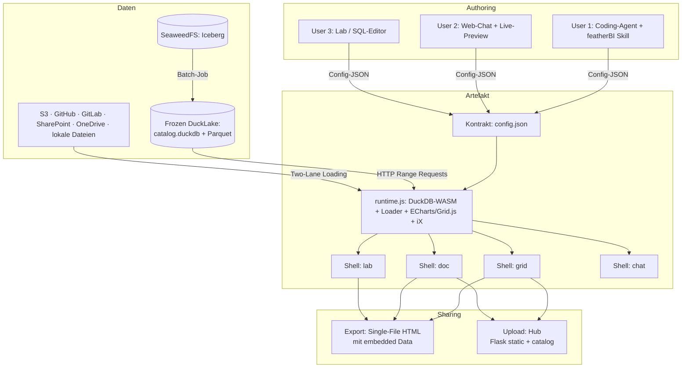

# Brainstorming & Architektur-Konzept: featherBI

> **Arbeitstitel:** featherBI — Serverless BI & Self-Service Analytics
> **Stand:** September 2026
> **Ziel:** Schlanker, wartungsarmer und kostengünstiger Ersatz für klassische BI-Tools (Tableau/Power BI) basierend auf Client-Side OLAP, generativer KI und Single-File-HTML im Siemens-Ökosystem.

---

## 1. Vision & Leitidee

**Ein Artefakt für alles.** Jedes Produkt — Dashboard, Report, SQL-Playground, Daten-Explorer, Data-Chat — ist dieselbe Einheit: eine **Single-File-HTML-Datei**, bestehend aus **einer Runtime + einer Config-JSON**. Die App-Typen unterscheiden sich nur in der Shell, die die Config rendert; die Nutzertypen unterscheiden sich nur im **Authoring-Pfad**, der die Config erzeugt.

### Nutzer

1. **User 1 (Coding-Agent):** Hat den featherBI-Skill installiert, Daten liegen lokal oder in S3 / OneDrive / SharePoint / GitHub / GitLab. Sagt dem Agent: „Erzeuge Dashboard" → „Teile das mit meinen Kollegen" / „Deploy das".
2. **User 2 (kein Agent):** Geht auf die Website, fügt Daten oder Daten-Link hinzu, beschreibt im Chat-UI iterativ das gewünschte Dashboard (permanente Live-Preview), sagt dann „Share" / „Deploy".
3. **User 3 (Explorer):** Will Daten ad-hoc erkunden — SQL-Playground oder Notebook-ähnliches Interface, inkl. Export als CSV / Parquet / JSON.

### App-Typen → 4 Shells

| App | Shell | Analog |
|---|---|---|
| Dashboard | `grid` | Power BI / Tableau / Superset |
| Report / Notebook | `doc` | evidence.dev (Markdown- + SQL- + Chart-Zellen) |
| SQL-Playground + Datei-Explorer | `lab` | sql-workbench.com / duckdb-playground |
| Talk-to-your-Data | `chat` | — |

Playground und Explorer sind **eine** Shell: Ein Explorer ist ein Playground mit gedroppter Datei und eingeklapptem Editor. (`grid` und `doc` können später mergen — ein Dashboard ist ein Report mit Kachel-Layout —, aber erst, wenn die Layouts stabil sind.)

### Leitprinzipien

- **Serverless wörtlich:** Sämtliche Ausführung (OLAP, Rendering, Export) läuft client-seitig via DuckDB-WASM. Der Server dient nur Dateien aus — keine Daten, kein Compute, im MVP kein LLM.
- **Deterministisches AI-Slop:** Die KI generiert kein Freitext-HTML, sondern eine strukturierte **Config-JSON** (SQL + Layout + ECharts-Spec), die in eine standardisierte Shell injiziert wird. Halluzinations-Oberfläche ≈ 0.
- **Identity im Browser:** Keine Secrets im HTML (liegt in Git!). Der Betrachter authentifiziert sich als er selbst (OIDC PKCE / eigener PAT); die Quellsysteme erzwingen ihre eigenen ACLs.

---

## 2. Zielarchitektur & Datenfluss



---

## 3. Der Kontrakt (Config-JSON)

Der Kontrakt ist **das eigentliche Produkt** — die API zwischen drei Authoring-Pfaden und vier Shells. Er wird von Tag eins versioniert (`"contract": 1`) und durch einen Validator geprüft, der sowohl in CI (GitOps-Pfad) als auch in der Chat-Preview läuft. Schema-Drift zwischen Skill-Output und Runtime ist der langfristige Hauptfehlermodus.

```jsonc
{
  "contract": 1,
  "app": "grid",                      // grid | doc | lab | chat
  "title": "Quality KPIs",
  "data": {
    "mode": "url",                    // "url" | "embedded" | "upload"
    "sources": [
      { "id": "catalog", "type": "ducklake", "href": "https://.../catalog.duckdb" },
      { "id": "orders",  "type": "parquet",  "href": "https://.../orders.parquet" }
    ]
  },
  "queries": {
    "q_quality": "SELECT ... GROUP BY ALL"
  },
  "layout": [
    { "type": "ix-kpi",  "query": "q_quality", "props": { } },
    { "type": "echarts", "query": "q_quality", "spec": { "series": [] } }
  ]
}
```

**Daten-Modi:**

- `embedded`: Base64-Parquet/CSV direkt im HTML → das „per E-Mail verschickbare" Artefakt, null Auth-Probleme. `# ponytail: Base64 bläht ~33 % auf, Browser werden ab ~50–100 MB HTML unglücklich — für aggregierte Cubes ok, große Daten nutzen mode=url.`
- `url`: HTTP Range Requests gegen gehostete Daten (Frozen DuckLake, S3, …).
- `upload`: Nutzer droppt Datei zur Laufzeit in die Shell.

---

## 4. Runtime (ein JS-Bundle)

### Datenformate

| Format | Support |
|---|---|
| CSV, Parquet, JSON | Nativ in DuckDB-WASM (`read_csv_auto`, `read_parquet`, `read_json`) — null Zusatzcode |
| XLSX | SheetJS (ein CDN-Tag) → Arrow → `registerFileBuffer`. Ehrlicher Preis des Pure-Client-Ansatzes; serverseitige Konvertierung entfällt. |

### Datenquellen: Two-Lane Loading

DuckDB-WASMs httpfs kann keine beliebigen Request-Header setzen. Daraus folgen zwei Lanes:

```js
// Lane 1: URL braucht keine Auth-Header → direkter Read, Range Requests, streaming
read_parquet('https://bucket.s3/...parquet?X-Amz-Signature=...')          // presigned
read_parquet('https://raw.githubusercontent.com/org/repo/main/f.parquet') // public

// Lane 2: Bearer-Token nötig → fetch() in JS, Bytes an WASM übergeben
const buf = await fetch(url, { headers: { Authorization: `Bearer ${token}` } })
                 .then(r => r.arrayBuffer());
ddb.registerFileBuffer('f.parquet', new Uint8Array(buf));
```

| Quelle | Lane | Mechanik |
|---|---|---|
| S3 presigned | 1 | Direkt — Bucket-CORS einmal konfigurieren |
| GitHub raw | 1 public / 2 private | Contents-API mit Raw-Accept-Header, CORS-fähig |
| GitLab (code.siemens) | 2 | Raw-File-API + PAT/OIDC-Token des Nutzers, API CORS-fähig |
| SharePoint / OneDrive | 2 | MSAL.js PKCE-Login → Graph API |
| Frozen DuckLake (intranet) | 1 | Bucket lesbar für Intranet → kein Presigning nötig. `# ponytail: Intranet-Read-Bucket; Signer-Endpoint erst, wenn Daten das VPN verlassen.` |

Wo Range nicht unterstützt wird: Whole-File-Download via `registerFileBuffer` — akzeptabel im Budget (≤ 100–200 MB pro Dashboard).

### Visualisierung & UI (3-stufige Hierarchie)

1. **Primary: Siemens iX** (`@siemens/ix` Web Components per CDN) — `<ix-card>`, `<ix-kpi>`, `<ix-select>`, `<ix-date-picker>`; offizielles Siemens Industrial Design (Dark Midnight & Petrol).
2. **Built-ins:** Apache ECharts (Sankey, Heatmap, Bar/Line, Treemap), Grid.js/Tabulator für Arrow-Tabellen mit Sortierung/Filterung.
3. **Fallback:** Tailwind + iX-CSS-Variablen (`var(--theme-color-component-1)` etc.) statt unkontrolliertem Nachladen externer Libraries.

### SQL-Dialekt-Vorgabe für die KI

Polars ist im Browser (WASM-Threading) schwergewichtig — DuckDB-SQL bildet Pipelines 1:1 ab und ist für LLMs trivial generierbar:

- CTEs (`WITH ...`) für lineare `.filter()`/`.with_columns()`-Ketten
- Regex-Operatoren: `order_number ~ '^6'`, `G0003 !~ 'PE100'`
- `NULLIF(col, 0)` statt `.replace(0, None)`, `bool_or(failed)` statt `.agg(any())`
- **`GROUP BY ALL`** — keine fehleranfälligen Spaltenlisten-Wiederholungen

---

## 5. Shells (dünn, ~100 Zeilen)

| Shell | Inhalt |
|---|---|
| `grid` | Kachel-Layout: KPI-Tiles + ECharts + Filter-Bar |
| `doc` | Scroll-Dokument: Markdown-, SQL-, Chart-Zellen (evidence.dev-artig) |
| `lab` | CodeMirror SQL-Editor + Schema-Browser + Ergebnis-Grid + Export-Buttons (`COPY ... TO` → WASM-Memory → Blob-Download, client-seitig) |
| `chat` | Chat-Verlauf + Daten-Kontext + Vorschau-Pane |

Gemeinsamer Code lebt ausschließlich in `runtime.js` — Shells deklarieren nur Layout.

---

## 6. Authoring-Pfade

### A. Skill (User 1) — deterministische Generierung

Vier fixe Elemente:

1. **`SKILL.md`** — Rollendefinition, Guardrails (nur `SELECT`, Datumsregeln), strikter Ausgabe-Vertrag (Kontrakt-JSON).
2. **`catalog_schema.sql`** — DDL aller Tabellen, fachliche Metrik-Definitionen (Fehlerraten, Kostenformeln), erlaubte Wertebereiche/Enums.
3. **Shell-Referenzen** — die vier Shells als Injektionsziele.
4. **`examples/`** — Few-Shot-Muster (KPI + Zeitreihe, Top-N Bar + Detailtabelle, Heatmap).

Der Skill erzeugt die Config, injiziert sie in die Shell, fertig ist die Datei. „Share/Deploy" = Export-Kommando oder Hub-Upload (s. §7).

### B. Web-Chat (User 2) — iterativ mit Live-Preview

Chat-UI + Schema-Kontext + Preview-Iframe, der **dieselbe Runtime** rendert. Jede Iteration = neue Config-Version. Die Preview ist gleichzeitig die Validierung — was live lief, ist per Definition ausführbar.

**Wiederverwendung:** Dieselbe Chat-Komponente bedient User 2 (Builder) und App-Typ `chat` (Talk-to-your-Data). Einmal bauen, zweimal nutzen.

**LLM-Zugang (einzige Backend-Frage im gesamten System):**

- **BYOK (MVP-Default):** Nutzer hinterlegt eigenen Siemens-LLM-Gateway-Key im Browser (localStorage), der Browser ruft das Gateway direkt. Serverless bleibt wahr.
- Alternative: geteilter Gateway-Key hinter einem kleinen Flask-Proxy-Endpoint.
- Entscheidung fällt vor Phase 4, nicht früher.

### C. Manuell (User 3)

Die `lab`-Shell selbst ist der Authoring-Pfad — kein LLM nötig. Ergebnis kann als Config gespeichert und in `grid`/`doc` überführt werden.

---

## 7. Sharing & Deploy — ein Flow für alle

- **Export Single-File:** Aktuelle Config + Data (`mode: embedded`) → ein HTML-Download. Funktioniert für alle Shells, null Infrastruktur.
- **Hub-Upload:** `POST /api/upload` legt die Datei in `dashboards/` ab und regeneriert den Katalog. User 2/3 klicken „Share", User 1 lässt den Agent hochladen.
- **GitOps-Pfad (optional, User 1):** Der Agent committet gegen `code.siemens`; CI validiert (JSON-Syntax, SQL-Dry-Run mit `LIMIT 1` gegen den Katalog) und deployt. Der Dry-Run-Gate gilt **nur** hier — chat-gebaute Dashboards wurden bereits live in der Preview validiert.

---

## 8. Hub (Flask)

- Statisches Ausliefern der Shells + Dashboards (`send_from_directory`, `conditional=True` → Range Requests out of the box)
- Katalog: `index.json` (bei Upload / per CI regeneriert) + Kachel-Übersicht mit Suche/Filter
- `POST /api/upload` für den Share-Flow
- **Explizit nicht:** Daten-Proxy, Compute, im MVP kein LLM-Proxy (BYOK)

Flask statt FastAPI: kein Async-Bedarf im MVP, einfachstes File-Routing. (Löst offenen Punkt 4 der Vorgängerversion.)

---

## 9. Datenplattform (2-Schichten)

1. **Datalake Core (SeaweedFS + Apache Iceberg / S3 Tables):** Universelle Source of Truth — Schema Evolution, Time Travel, ACID, Multi-Engine-Zugriff (Python, Polars, Spark). Batch-Befüllung stündlich/täglich.
2. **Frozen DuckLake (Serving):** Batch-Job erzeugt schreibgeschützte `catalog.duckdb` + vorkomprimierte Parquets auf SeaweedFS/S3. Browser: `ATTACH 'https://.../catalog.duckdb' (READ_ONLY)` per HTTP Range Requests. Aggregationsgrad der Parquets ist der zentrale Performance-Regler.

Ad-hoc-Daten (Uploads, Links) umgehen die Plattform komplett — sie landen direkt in der Runtime (Two-Lane, §4).

---

## 10. Sicherheit & Identität

- **Keine Secrets in Artefakten:** HTML-Dateien liegen in Git und werden geteilt — sie enthalten nie Tokens.
- **Identity im Browser:** Betrachter authentifiziert sich pro Quelle als er selbst (OIDC PKCE wo möglich, PAT in localStorage sonst). Das Quellsystem erzwingt seine eigene ACL → Row-/Objekt-Level-Security ist delegiert, nicht nachgebaut. (Löst offenen Punkt 1.)
- **Frozen DuckLake:** Intranet-lesbarer Bucket, kein Signing-Aufwand.
- **LLM:** BYOK — der Key verlässt den Browser des Nutzers nicht Richtung featherBI-Server.

---

## 11. Risiken & Spikes (vor Baubeginn, in dieser Reihenfolge)

1. **DuckLake-over-HTTP ATTACH in WASM** — riskanteste Einzelannahme der Architektur. Spike: `ATTACH 'https://...' (READ_ONLY)` im Browser gegen eine Test-Datei.
2. **SharePoint downloadUrl CORS** — Graph-Pre-Auth-URLs senden historisch unzuverlässige CORS-Header. Fallback: `fetch()` (funktioniert, verliert Range-Streaming).
3. **MSAL App-Registration im Siemens-Tenant** — braucht Tenant-Consent. Kalender- Risiko, kein Code-Risiko → Paperwork früh starten.
4. **Schema-Drift** — Kontrakt-Versionierung + Validator in CI *und* Preview von Tag eins.
5. **Browser-Memory-Budget** — 100–200 MB Range-Traffic je Dashboard als Obergrenze definieren; Aggregationsgrad im Frozen DuckLake entsprechend wählen.

---

## 12. MVP-Phasen (jede Phase liefert Nutzbares)

| Phase | Umfang | Nutzer | Backend | LLM |
|---|---|---|---|---|
| **1** | Kontrakt + Runtime + `grid`-Shell + Skill + Single-File-Export | User 1 | keins | Skill-seitig (Agent des Nutzers) |
| **2** | `lab`-Shell (Playground/Explorer + Export) | User 3 | keins | nein |
| **3** | Hub (Flask static + Katalog + Upload) | Sharing für alle | Flask static | nein |
| **4** | `chat`-Shell + Chat-UI + BYOK | User 2 + Talk-to-Data | Flask static | BYOK |

Phasen 1–3 brauchen weder LLM-Hosting noch Auth-Infrastruktur — die gesamte Risiko-/Kostenfläche liegt in Phase 4, und bis dahin ist der Kontrakt kampferprobt.

---

## 13. Komponenten-Struktur (Repo)

```text
featherbi/
├── contract/     # Config-JSON-Schema (versioniert) + Validator — die wichtigste Datei
├── runtime/      # ein JS-Bundle: DuckDB-WASM Boot, Two-Lane-Loader, ECharts/Grid, iX
├── shells/       # grid.html · doc.html · lab.html · chat.html (dünn)
├── skill/        # featherBI Agent-Skill (SKILL.md, catalog_schema.sql, examples/)
├── chat-ui/      # Chat-Komponente (User-2-Builder UND Talk-to-Data)
└── hub/          # Flask: static + index.json-Katalog + /api/upload
```

---

## 14. Entscheidungen & offene Punkte

**Entschieden (gegenüber Vorgängerversion):**

- ✅ Flask statt FastAPI (kein Async-Bedarf im MVP)
- ✅ RLS → delegiert an Quellsystem-ACLs via Identity-im-Browser
- ✅ Playground + Explorer = eine Shell (`lab`)
- ✅ XLSX client-seitig via SheetJS (Konsequenz aus Pure-Client)
- ✅ Kein Daten-Proxy — Two-Lane Loading komplett im Browser
- ✅ CI-Dry-Run nur im GitOps-Pfad; Chat-Pfad validiert über Live-Preview
- ✅ Serverless wörtlich: Server dient nur Dateien, kein Compute, keine Daten

**Offen:**

1. BYOK vs. geteilter LLM-Proxy (Entscheidung vor Phase 4)
2. Promote-to-Dashboard UX im Git-Pfad: Direkt-Commit vs. Merge-Request-Review
3. Chat-Interface: Standalone-Web-Chat vs. Integration in Siemens-Chat-Tools
4. Konkrete Größen-Obergrenzen & Aggregationsgrad des Frozen DuckLake (nach Spike 1/5)
